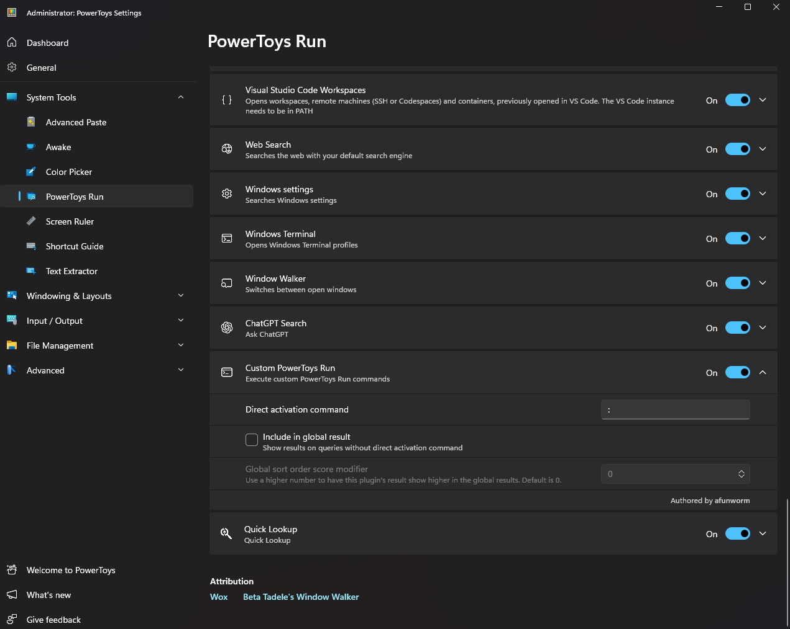

# Custom PowerToys Run | Run Your Custom PowerToys Run Command

### Limitation

Only tested on x64 Windows.

### Screenshots

To be coming.

### Installation & Usage

1. Extract the CustomPowerToysRun to the installation folder according to [Microsoft's guide](https://github.com/microsoft/PowerToys/blob/main/doc/thirdPartyRunPlugins.md).
2. Open PowerToys Runs and enable the plugin.
   
3. You can now activate your custom command using ":" or whichever direct activation you have configured. Try ":youtube".

Some built-in commands for demo purposes when you first run the plugin:

1. **config** - Open the commands.txt file so you can customize your comamands.
2. **yt**, **youtube** - Open Youtube on your browser.
3. **fb**, **facebook** - Open Facebook on your browser.
4. **reddit** - Open Reddit on your browser.
5. **x**, **twitter** - Open Twitter on your browser.
6. **social** - Open Youtube, Twitter, and Facebook on your browser.
7. **demo** - Open a demo dialog generated by Powershell.

Commands are case insensitive, and can be fully customized by editing the `commands.txt` file in the plugin directory. This file will be generated on the first run if it doesn't exist.
